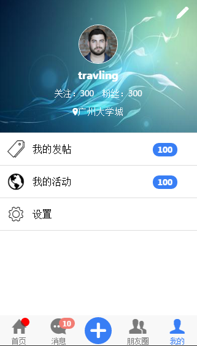

# ionic-social-app

ionic app social -- a free app as demo to learn ionic... 
ionic is a web framework for us to develop web apps ... 
bla bla bla... 

# How to use
* At first, you should learn to install the environment of ionic. "<a href="http://ionic.io/">click here to learn</a>"
* Then, just download the project..."git clone ..."
* You can use the web browser to run the demo by use the command after installing the environment:
	* cd /ionic-social-app
	* ionic serve -lc     
	
# The Screenshot

# Learn More

<a href="http://www.cnblogs.com/Lxiaolong/p/5399008.html">**中文教程Blog**</a>

#License

Social is open source and covered by a standard 2-clause BSD license. See the LICENSE file for more info.

Social is Free Software licensed under the GNU General Public License.

